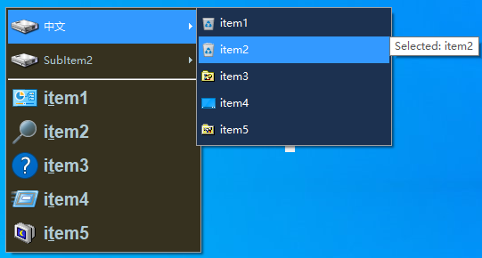

# PUM
PUM library for AHK v2

- Usage Example:

- 

- Code:

- ```
  #Requires AutoHotkey v2.0
  #Include PUM.v2.ahk
  
  ; parameters of the PUM object, the manager of the menus
  pumParams := { SelMethod : "fill"            ;item selection method, may be frame,fill
                  ;~ ,"selTColor" : -1         ;selection text color
                  ;~ ,"selBGColor" : -1              ;selection background color, -1 means invert current color
                  ,oninit      : "PUM_out"      ;function which will be called when any menu going to be opened
                  ,onuninit    : "PUM_out"     ;function which will be called when any menu going to be closing
                  ,onselect    : "PUM_out"     ;;function which will be called when any item selected with mouse (hovered)
                  ,onrbutton   : "PUM_out"   ;function which will be called when any item right clicked
                  ,onmbutton   : "PUM_out"  ;function which will be called when any item clicked with middle mouse button
                  ,onrun       : "PUM_out"      ;function which will be called when any item clicked with left mouse button
                  , onshow : "PUM_out"      ;function which will be called before any menu shown using Show method
                  , onclose : "PUM_out"        ;function called just before quitting from Show method
                  ,mnemonicCMD : "select"}
                  
  ;PUM_Menu parameters
  menuParams1 := { bgcolor : 0x36311f   ;background color of the menu
              , iconssize : 32          ;size of icons in the menu
              , tcolor : 0xafc9d3 }     ;text color of the menu items
  menuParams2 := { bgcolor : 0x1C3150
              , iconssize : 16
              , tcolor : 0xFFFFFF }
  
  ;create an instance of PUM object, it is best to have only one of such in the program
  pm := PUM(pumParams)
  
  ;creating popup menu, represented by PUM_Menu object with given parameters
  popmenu := pm.CreateMenu( menuParams1 )
  
  ;create a three othe menus
  newmenu1 := pm.CreateMenu( menuParams2 )
  newmenu2 := pm.CreateMenu( menuParams2 )
  newmenu3 := pm.CreateMenu( menuParams2 )
  
  ;adding submenu items to the first menu, item SubItem1 will open "newmenu1" menu, and SubItem2 will open "newmenu2"
  popmenu.add( { name : "中文", submenu : newmenu1, icon : "shell32.dll:8"  } )
  popmenu.add( { name : "SubItem2", submenu : newmenu2, icon : "shell32.dll:8" } )
  popmenu.Add()  ;adding separator
  ;adding a submenu item "SubItem3" to the "newmenu2" menu, which opens "newmenu3" menu
  newmenu2.add( { name : "SubItem3", icon : "shell32.dll:8", submenu : newmenu3 } )
  
  
  ;adding five items to the first menu
  Loop 5 {
    popmenu.Add({ name : "i&tem" A_Index
                , bold : 1
                , icon : "shell32.dll:" A_Index + 20 })
  }
  ;adding five items to the newmenu1
  Loop 5 {
    newmenu1.add({ name : "item" A_Index, icon : "shell32.dll:3" A_Index })
  }
  ;adding five items to the newmenu2
  Loop 5 {
    newmenu2.add({ name : "item" A_Index, icon : "shell32.dll:4" A_Index })
  }
  ;adding five items to the newmenu3
  Loop 5 {
    newmenu3.add({ name : "item" A_Index, icon : "shell32.dll:2" A_Index, disabled : 1 })
  }
  
  ;showing the first menu at the center of screen (~)
  if item := popmenu.Show(A_ScreenWidth / 3, A_ScreenHeight / 3)
    MsgBox("Choosen item: " item.name)
  
  ;Destroying all menus/items created
  ;Use Destroy() method for the PUM_Menu object if you want to destroy specific menu
  pm.Destroy()
  ExitApp()
  
  PUM_out(msg, obj) {
    if (msg = "onselect") {
      rect := obj.GetRECT()
      CoordMode("ToolTip", "Screen")
      ToolTip("Selected: " obj.name, rect.right, rect.top)
    }
    if (msg ~= "oninit|onuninit|onshow|onclose")
      ToolTip("menu " msg ": " obj.handle)
    if (msg = "onrbutton")
      ToolTip("Right clicked: " obj.name)
    if (msg = "onmbutton")
      ToolTip("Middle clicked: " obj.name)
    if (msg = "onrun")
      ToolTip("Item runned: " obj.name)
  }
  
  ```

  
